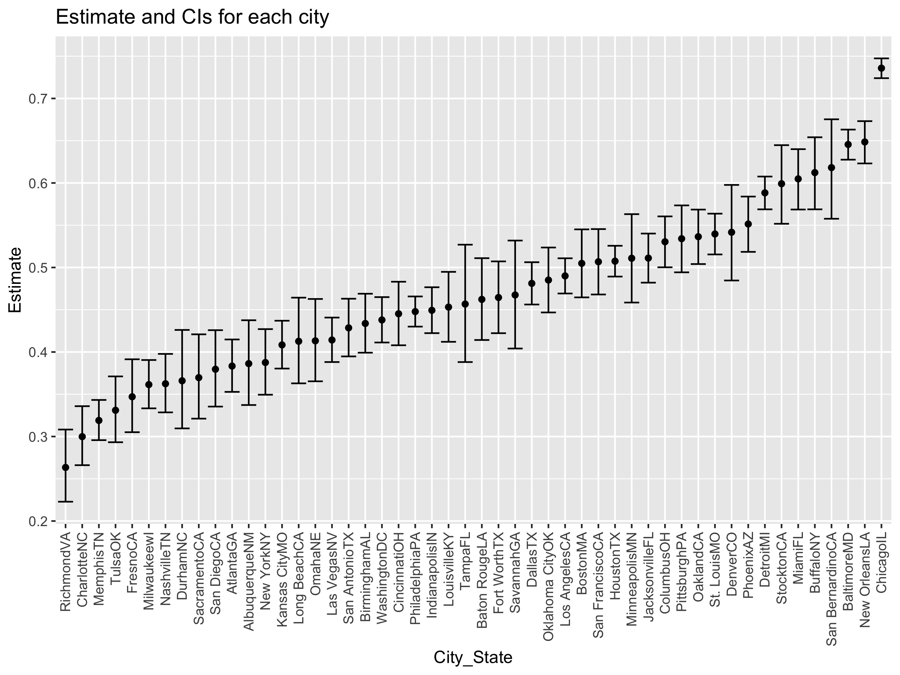

P8105\_HW5\_yz4181
================
Yuanyuan Zeng(yz4181)
11/16/2021

    ## ── Attaching packages ─────────────────────────────────────── tidyverse 1.3.1 ──

    ## ✓ ggplot2 3.3.5     ✓ purrr   0.3.4
    ## ✓ tibble  3.1.4     ✓ dplyr   1.0.7
    ## ✓ tidyr   1.1.3     ✓ stringr 1.4.0
    ## ✓ readr   2.0.1     ✓ forcats 0.5.1

    ## ── Conflicts ────────────────────────────────────────── tidyverse_conflicts() ──
    ## x dplyr::filter() masks stats::filter()
    ## x dplyr::lag()    masks stats::lag()

## Problem 1

``` r
## load the data set
homicide_df= read_csv("./homicide-data.csv", na = c("", "unknown")) %>% print()
```

    ## Rows: 52179 Columns: 12

    ## ── Column specification ────────────────────────────────────────────────────────
    ## Delimiter: ","
    ## chr (9): uid, victim_last, victim_first, victim_race, victim_age, victim_sex...
    ## dbl (3): reported_date, lat, lon

    ## 
    ## ℹ Use `spec()` to retrieve the full column specification for this data.
    ## ℹ Specify the column types or set `show_col_types = FALSE` to quiet this message.

    ## # A tibble: 52,179 × 12
    ##    uid        reported_date victim_last  victim_first victim_race victim_age
    ##    <chr>              <dbl> <chr>        <chr>        <chr>       <chr>     
    ##  1 Alb-000001      20100504 GARCIA       JUAN         Hispanic    78        
    ##  2 Alb-000002      20100216 MONTOYA      CAMERON      Hispanic    17        
    ##  3 Alb-000003      20100601 SATTERFIELD  VIVIANA      White       15        
    ##  4 Alb-000004      20100101 MENDIOLA     CARLOS       Hispanic    32        
    ##  5 Alb-000005      20100102 MULA         VIVIAN       White       72        
    ##  6 Alb-000006      20100126 BOOK         GERALDINE    White       91        
    ##  7 Alb-000007      20100127 MALDONADO    DAVID        Hispanic    52        
    ##  8 Alb-000008      20100127 MALDONADO    CONNIE       Hispanic    52        
    ##  9 Alb-000009      20100130 MARTIN-LEYVA GUSTAVO      White       56        
    ## 10 Alb-000010      20100210 HERRERA      ISRAEL       Hispanic    43        
    ## # … with 52,169 more rows, and 6 more variables: victim_sex <chr>, city <chr>,
    ## #   state <chr>, lat <dbl>, lon <dbl>, disposition <chr>

-   Description of raw dataset: The original data contains 52179 rows
    and 12 columns. The variables includes the case number, reported
    date, names and identities of victims, city and states of the cases,
    locations, and disposition. There are missing value in latitude and
    longitude columns. The value in age column is not consistent.

#### Unsolved and total homocides within each city

``` r
## Clean data set
homicide_df = homicide_df %>% 
  mutate(city_state = str_c(city, state),
         resolution = case_when(
           disposition == "Closed without arrest" ~ "unsolved",
           disposition == "Open/No arrest" ~ "unsolved",
           disposition == "Closed by arrest" ~ "solved")) %>% 
  relocate(city_state) %>% 
  filter(city_state != "TulsaAL")

# summarize within city
total_homocide = homicide_df %>% 
  select(city_state) %>% 
  group_by(city_state) %>% 
  summarize(
    total_homocides = n()) 
 
number_unsolved = homicide_df %>% 
  select(city_state, resolution) %>% 
  filter(resolution == "unsolved") %>% 
  group_by(city_state) %>% 
  summarize(
    number_unsolved = n())

summary_within_city = left_join(number_unsolved, total_homocide) %>%  print()
```

    ## Joining, by = "city_state"

    ## # A tibble: 50 × 3
    ##    city_state    number_unsolved total_homocides
    ##    <chr>                   <int>           <int>
    ##  1 AlbuquerqueNM             146             378
    ##  2 AtlantaGA                 373             973
    ##  3 BaltimoreMD              1825            2827
    ##  4 Baton RougeLA             196             424
    ##  5 BirminghamAL              347             800
    ##  6 BostonMA                  310             614
    ##  7 BuffaloNY                 319             521
    ##  8 CharlotteNC               206             687
    ##  9 ChicagoIL                4073            5535
    ## 10 CincinnatiOH              309             694
    ## # … with 40 more rows

-   Summary: The table showing the number of unsolved homocides and
    total number of homocides in each city.

#### Look at the homicides in the city of Baltimore, MD

``` r
baltimoreMD = homicide_df %>% 
  filter(city_state == "BaltimoreMD") %>% 
  summarize(
    unsolved = sum(resolution == "unsolved"),
    total_homocide = n())

baltimore_test = prop.test(
  x = baltimoreMD %>% pull(unsolved),
  n = baltimoreMD %>% pull(total_homocide))

baltimore_test %>% 
  broom::tidy() %>% 
  select(
    estimate,
    conf.low,
    conf.high)
```

    ## # A tibble: 1 × 3
    ##   estimate conf.low conf.high
    ##      <dbl>    <dbl>     <dbl>
    ## 1    0.646    0.628     0.663

-   The table shows that the estimate proportion of unsolved homicides
    in Baltimore is 0.6456 and the confident interval is between 0.6276
    and 0.6632.

#### Run the prop test for each cities

``` r
## set up function
prop_test_function = function(city_df){
  
  city_summary =
    city_df %>% 
    summarize(
      unsolved = sum(resolution == "unsolved"),
      total = n()
      )
      
  city_test = prop.test(
    x = city_summary %>% pull(unsolved),
    n = city_summary %>% pull(total))
  
  return(city_test)
  }

## Perform prop test using map function
result_df = homicide_df %>% 
  nest(data = uid:resolution) %>% 
  mutate(
    test_result = map(data, prop_test_function),
    tidy_result = map(test_result, broom::tidy)
  ) %>% 
  select(
    city_state,
    tidy_result) %>% 
  unnest(tidy_result) %>% 
  select(
    city_state,
    estimate,
    starts_with("conf")) %>% 
  print()
```

    ## # A tibble: 50 × 4
    ##    city_state    estimate conf.low conf.high
    ##    <chr>            <dbl>    <dbl>     <dbl>
    ##  1 AlbuquerqueNM    0.386    0.337     0.438
    ##  2 AtlantaGA        0.383    0.353     0.415
    ##  3 BaltimoreMD      0.646    0.628     0.663
    ##  4 Baton RougeLA    0.462    0.414     0.511
    ##  5 BirminghamAL     0.434    0.399     0.469
    ##  6 BostonMA         0.505    0.465     0.545
    ##  7 BuffaloNY        0.612    0.569     0.654
    ##  8 CharlotteNC      0.300    0.266     0.336
    ##  9 ChicagoIL        0.736    0.724     0.747
    ## 10 CincinnatiOH     0.445    0.408     0.483
    ## # … with 40 more rows

``` r
## (Alternative) perform prop test using map2 function
homicide_df %>% 
  group_by(city_state) %>% 
  summarize(
    unsolved = sum(resolution == "unsolved"),
    total = n()) %>% 
  mutate(
    test_result = map2(unsolved, total, prop.test),
    tidy_result = map(test_result, broom::tidy)) %>% 
  unnest(tidy_result) %>% 
  select(city_state, estimate, starts_with("conf"))
```

    ## # A tibble: 50 × 4
    ##    city_state    estimate conf.low conf.high
    ##    <chr>            <dbl>    <dbl>     <dbl>
    ##  1 AlbuquerqueNM    0.386    0.337     0.438
    ##  2 AtlantaGA        0.383    0.353     0.415
    ##  3 BaltimoreMD      0.646    0.628     0.663
    ##  4 Baton RougeLA    0.462    0.414     0.511
    ##  5 BirminghamAL     0.434    0.399     0.469
    ##  6 BostonMA         0.505    0.465     0.545
    ##  7 BuffaloNY        0.612    0.569     0.654
    ##  8 CharlotteNC      0.300    0.266     0.336
    ##  9 ChicagoIL        0.736    0.724     0.747
    ## 10 CincinnatiOH     0.445    0.408     0.483
    ## # … with 40 more rows

-   Summary: The table shows the estimate proportion of unsolved
    homocides and confident interval within each city.

#### Creata a plot show the estimate and CI for each city

``` r
## Creating a plot
result_df %>% 
  mutate(
    city_state = fct_reorder(city_state, estimate)
  ) %>% 
  ggplot(aes(x= city_state, y = estimate)) +
  geom_point() +
  geom_errorbar(aes(ymin = conf.low, ymax = conf.high)) +
  theme(axis.text.x = element_text(angle = 90, vjust =0.5, hjust = 1)) +
  labs(
    x = "City_State",
    y = "Estimate"
  )
```

<!-- -->
